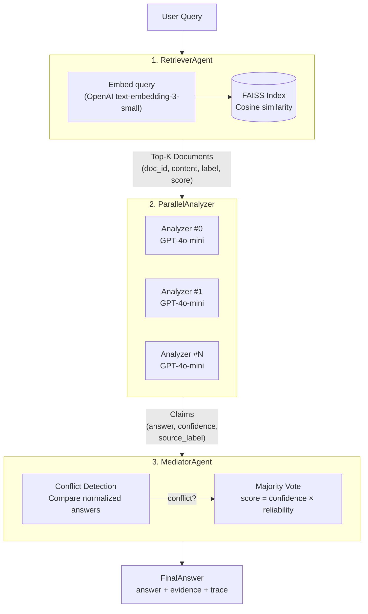

# Part A, Architecture & Design

## System Architecture Diagram



## 1. Agent Definitions

The system uses four agents, three core ones and a coordinator that manages parallel execution. Each agent has a clear, single responsibility and well-defined inputs and outputs.

### Agent 1: RetrieverAgent

The Retriever is the entry point of the pipeline. It takes a user's natural language question and finds the most relevant documents from the indexed corpus.

Under the hood, it wraps a FAISS index that stores OpenAI embeddings (`text-embedding-3-small`). When a query comes in, the agent embeds it using the same model, runs a cosine similarity search (via normalized inner product), and returns the top-K documents.

- **Input:** User query (string), top_k parameter (default 5)
- **Output:** List of `Document` objects, each with `doc_id`, `content`, `label` (correct/misinfo/noise from dataset), and `relevance_score`
- **Location:** `src/agents/retriever.py` + `src/indexing.py`

Why it matters: the retriever doesn't just return text, it passes through the document labels from RAMDocs. These labels are used downstream by the Mediator to weight how much each source is trusted. The agent itself doesn't filter or judge, it just retrieves and hands off.

### Agent 2: DocumentAnalyzer (+ ParallelAnalyzer coordinator)

This is where claim extraction happens. For each retrieved document, a separate DocumentAnalyzer instance is created. Each one sends the document + query to GPT-4o-mini and asks it to extract:

- Whether the document answers the question at all
- The actual answer/claim
- A confidence score (0.0–1.0) based on how clearly the document states it
- A supporting quote from the document text

The LLM responds in JSON format, which gets parsed into a `Claim` object. The `source_label` from the original document is carried through, this is what enables reliability scoring later.

- **Input:** Single `Document` + the original query
- **Output:** `Claim(doc_id, answer, confidence, supporting_quote, source_label)` wrapped in an `AnalysisResult` (which also tracks success/failure)
- **Location:** `src/agents/analyzer.py`

The **ParallelAnalyzer** is the coordinator. It's not really a separate "agent" in the thinking sense, it's the orchestrator that spawns N DocumentAnalyzer instances and runs them concurrently using asyncio with a semaphore (max 5 concurrent). It collects all the results and returns the full list of claims.

This fan-out/fan-in pattern is important because:
1. Each document analysis is independent, no shared state
2. LLM calls are the bottleneck, so parallelizing them cuts total latency roughly by N
3. Each instance has its own `instance_id` for tracking/debugging

### Agent 3: MediatorAgent

The Mediator receives all extracted claims and decides on the final answer. It does two things:

**Conflict Detection:** Normalizes all answers (lowercase, strip whitespace) and checks if there are multiple distinct answers. If everyone agrees, there's no conflict and answer is returned.

**Conflict Resolution (Majority Vote + Reliability Scoring):** When claims disagree, each claim gets a weighted score calculated as:

```
weighted_score = confidence × reliability_score
```

Where `confidence` comes from the LLM's assessment of the document, and `reliability_score` comes from the source label:
- `correct` → 1.0 (fully trusted)
- `unknown` → 0.7 (neutral)
- `noise` → 0.3 (likely irrelevant, downweighted)
- `misinfo` → 0.1 (known misinformation, heavily penalized)

All scores for the same normalized answer are summed up, and the answer with the highest total wins. The supporting claims and rejected claims are separated, both are included in the final output for transparency.

- **Input:** Query (string) + list of `Claim` objects
- **Output:** `(final_answer, supporting_claims, rejected_claims, explanation)`
- **Location:** `src/agents/mediator.py`

The key insight here is that the Mediator doesn't make any LLM calls itself. It's pure logic. This keeps it fast, deterministic, and cheap. The "intelligence" comes from combining the LLM-generated confidence scores with the reliability weights.

### How They Fit Together

The `RAGPipeline` (`src/pipeline.py`) orchestrates the whole flow:

```
User Query
    → RetrieverAgent.retrieve(query)        → top-K documents
    → ParallelAnalyzer.analyze(query, docs) → list of claims
    → MediatorAgent.reconcile(query, claims) → final answer + evidence
    → FinalAnswer (with full trace)
```

Each agent only knows about its own inputs and outputs. The pipeline is the only component that sees the full picture. This makes it easy to swap any agent, e.g., replace FAISS with a different index, or change the resolution strategy, without touching the others.

## 2. Inter-Agent Communication Protocol

Agents don't talk to each other directly. All communication goes through the `RAGPipeline` orchestrator, which calls each agent in sequence and passes outputs from one as inputs to the next. It's a simple pipeline pattern, no message queues, no event buses, no shared state.

### Why This Approach

The agents always run in the same order:  Retriever → Analyzer → Mediator. There's no branching, no conditional routing, no back-and-forth negotiation. 

### How It Actually Works

The pipeline calls each agent in sequence `RetrieverAgent.retrieve()` → `ParallelAnalyzer.analyze()` → `MediatorAgent.reconcile()`, passing the output of one directly as input to the next, and assembles the final result into a `FinalAnswer` with a complete execution trace.

### Data Contracts

The agents communicate through shared dataclasses defined in `src/models.py`. These serve as the "contracts" between agents:

- `Document`, passed from Retriever to Analyzer. Contains the text and metadata.
- `Claim`, passed from Analyzer to Mediator. Contains the extracted answer, confidence, and source reliability info.
- `FinalAnswer`, the pipeline's output. Contains everything needed to explain the decision.

Because these are plain Python dataclasses, there's no serialization overhead and no ambiguity about types.

### Tracing

The pipeline logs every step with timestamps into a `trace` list. This gives you a complete record of what happened, in order, for every query. It's useful for debugging and for showing evaluators that the system actually follows the described flow.

## 3. Conflict Detection & Resolution Strategy

### The Problem

When multiple documents for a question are retrieved, they don't always agree. A naive RAG system that just picks the top-1 document would make a mistake in this case.

So it is needed: a way to detect that documents disagree, and a way to pick the right answer anyway.

### Conflict Detection

The MediatorAgent handles this in `detect_conflicts()`.

The detection returns a `ConflictInfo` object with:
- `has_conflict` (bool)
- `conflicting_answers` (the distinct answers found)
- `explanation` (human-readable summary)

This keeps it simple.

### Resolution: Reliability-Weighted Majority Vote

When a conflict is detected, the Mediator resolves it using `resolve_by_majority_vote()`. The idea is simple but effective, let the claims "vote" on the answer, but not all votes are equal.

Each claim's vote is weighted by two factors:

**1. Confidence (from the LLM Analyzer):**
This is the LLM's assessment of how clearly/explicitly the document answers the question. A document that says "The capital of Australia is Canberra" gets ~0.95. A document that vaguely mentions Canberra in passing might get ~0.5. This score is assigned per-document by GPT-4o-mini during the analysis step.

**2. Reliability Score (from source metadata):**
This reflects how much the source is trusted. In our implementation, it's derived from the RAMDocs label:

| Source Label | Reliability Weight | Reasoning |
|---|---|---|
| `correct` | 1.0 | Known trustworthy source |
| `unknown` | 0.7 | No signal either way, slight discount |
| `noise` | 0.3 | Likely irrelevant, heavily discounted |
| `misinfo` | 0.1 | Known misinformation, almost ignored |

The combined score for each claim is: `weighted_score = confidence × reliability_score`

All scores for the same normalized answer get summed up. The answer with the highest total wins.

### What Gets Returned

After resolution, the Mediator returns:
- **The winning answer** (original casing from the first supporting claim)
- **Supporting claims**, all claims that agreed with the winner
- **Rejected claims**, all claims that disagreed
- **Explanation**, a human-readable string like "Resolved by reliability-weighted majority vote. 2 sources support 'Canberra', 1 rejected."

Both supporting and rejected claims are included in the final output. This transparency is important, the user can see exactly why certain sources were overruled and which ones backed the answer.

### A Note on Reliability Scores

In this prototype, reliability scores come from the RAMDocs dataset labels. In a production system, these labes does not exist. Instead, reliability would be determined from other signals: source reputation, cross-referencing with known facts, document recency, author credibility, etc. The architecture supports `reliability_score` as it is a property on the `Claim` model.

## 4. Metadata & Version Handling

### How Metadata Flows Through the Pipeline

Each data model carries specific metadata that gets passed forward through the pipeline:

- **Document**, `doc_id` (unique identifier for tracing), `label` (source type from the dataset), `relevance_score` (FAISS cosine similarity to the query)
- **Claim**, inherits `source_label` from its parent Document, plus the LLM-assigned `confidence` and extracted `answer`
- **FinalAnswer**, carries the full list of supporting and rejected claims, so every piece of metadata is traceable back to its source document

The key design decision here is that metadata propagates forward, nothing gets discarded along the way. When the Mediator picks a winning answer, the final output still contains the `doc_id`, label, confidence, and relevance score for every document that was analyzed. This makes the system fully auditable: you can trace exactly which documents contributed to the answer and why certain sources were weighted differently.

The reliability weighting itself (how labels map to trust scores) is covered in section 3 above. What matters from a metadata perspective is that this information lives on the model (`Claim.reliability_score` is a computed property), not in the Mediator logic. The Mediator just reads a number, it doesn't know or care where it came from.

### Versioning

The RAMDocs dataset has no temporal dimension, no timestamps, version numbers, or publication dates. All documents for a given question exist in the same time context. However, if documents had temporal metadata, system could be extended with:

**1. The Document model**, add fields like `published_date` and `source_authority`:
```python
@dataclass
class Document:
    doc_id: str
    content: str
    label: str = "unknown"
    relevance_score: float = 0.0
    published_date: Optional[datetime] = None
    source_authority: float = 1.0  # e.g., 1.0 for .gov, 0.4 for blog
```

**2. The Claim.reliability_score property**, factor in recency and authority alongside the existing label weight:
```python
@property
def reliability_score(self) -> float:
    base = label_weights.get(self.source_label, 0.7)
    recency = compute_recency_decay(self.published_date)  # e.g., 0.5 if >2 years old
    return base * self.source_authority * recency
```

The Mediator wouldn't need any changes, it already consumes `reliability_score` as a black box. This is the benefit of keeping the weighting logic on the model rather than in the resolution code. You add new metadata dimensions by extending the property, and the rest of the pipeline works unchanged.

## 5. Trade-offs

The main latency bottleneck is the LLM analysis step. Each retrieved document requires one GPT-4o-mini call to extract a claim, so with top_k=5 that's five calls per query. These run in parallel via asyncio with a concurrency semaphore, bringing the total analysis time down to roughly one call's duration (~1–2s) rather than five sequential ones. Everything else is fast, FAISS search takes milliseconds, the majority vote is plain arithmetic, and the query embedding is a single API call (~0.2s). End-to-end latency is dominated by the analyzer.

Lowering top_k would reduce latency, but conflict detection needs enough documents to actually surface a disagreement. With only two documents, the system might only see sources that agree, and the resolution logic never activates. top_k=5 strikes a reasonable balance.

On the cost side, a single query runs about ~$0.005 at current OpenAI pricing, five GPT-4o-mini calls for analysis plus one embedding call. The Mediator adds zero cost since it's pure logic with no LLM involvement. This also makes the resolution step fully deterministic—given the same claims, you always get the same answer, which simplifies debugging and makes results reproducible. Index building has a one-time embedding cost (a few cents for the RAMDocs scale), and those embeddings can be cached.

For scaling, the current FAISS IndexFlatIP does exact O(n) search, which works fine up to ~1K documents. Beyond that, switching to approximate indices like IndexIVFFlat or IndexHNSW keeps search sub-linear without changing the retriever interface. IndexHNSW typically achieves 95%+ recall at 10-50x speedup over brute force. At 1M+ documents, a dedicated vector database (Milvus, Weaviate, Pinecone) would replace the in-memory index, again, only the `FAISSIndex` class changes. For high query volume, caching query embeddings and analysis results avoids redundant LLM calls entirely. Horizontal scaling is straightforward because the pipeline is stateless: each query runs independently with no shared memory between requests. Multiple pipeline instances can run behind a load balancer, each with its own copy of the index (or pointing to a shared vector database). The LLM calls are already the bottleneck, so adding more instances scales throughput linearly until OpenAI rate limits become the constraint. The agent isolation in the architecture makes all of these upgrades localized, swapping the index backend or the resolution strategy doesn't require touching any other component.
